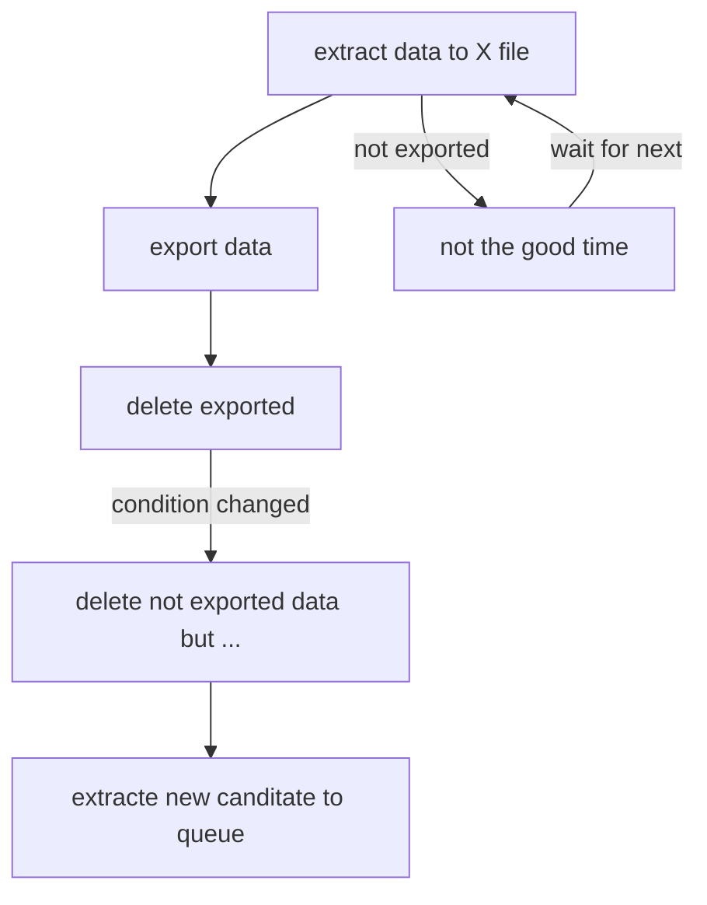

#test 

```mermaid
graph TD;
    A[extract data to X file ]-->B[export data];
    A--not exported-->F[not the good time]
    F--wait for next -->A
    B-->C[delete exported];
    C--condition changed -->D[delete not exported data but ...];
    D-->E[extracte new canditate to queue];

```

