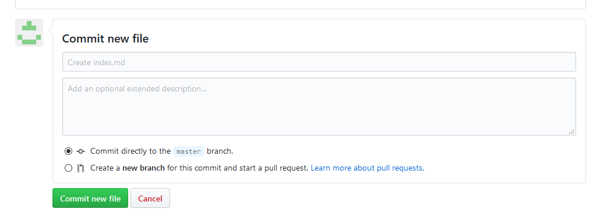

# ID の取得
- githubのアクセス [github](https://github.com/)
- 手順に従てIDをゲット
  


# 編集画面を開く

こちらは編集画面[クリック](https://github.com/benjaminlglin/benjaminlglin.github.io)

- 直接編集
- Loaclにて編集そしてアップロード
  
# 編集方法

画面上にて直接編集をすることが可能。基本ルールは少しだけあるけど。

## 構造
基本的に、**Folder**単位
- folder名は任意、重複してないなら
- ファイル名は index.md に固定
    - 


- 利用された画像も同じFolderの配下に置く
    - 


## MD ファイル編集

編集は例のように、簡単な記号だけを覚える必要があるが、HTMLなど難しいそうなタッグは一切使わない。


### 画像の表示
前例の画像を表示させるために、下記タグを覚える必要がある
```md

```


## 保存

　保存ボタンの位置は頁の一番したに


# preview

## preview tabを利用


## urlをたたく
> 002 はFolder名

https://benjaminlglin.github.io/002/


# localで編集して、Drag＆Drapてアップロードする方法
upload files を選ぶ


Folder全体をDrag＆Drap


